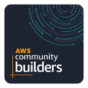

<p align="center">
  <a href="https://github.com/nadtakanf/todo-list">
    
  </a>

  <h3 align="center">Todo List API</h3>
</p>

<!-- TABLE OF CONTENTS -->
<details open="open">
  <summary>Table of Contents</summary>
  <ol>
    <li>
      <a href="#about-the-project">About The Project</a>
      <ul>
        <li><a href="#built-with">Built With</a></li>
      </ul>
    </li>
    <li>
      <a href="#getting-started">Getting Started</a>
      <ul>
        <li><a href="#prerequisites">Prerequisites</a></li>
        <li><a href="#installation">Installation</a></li>
      </ul>
    </li>
    <li><a href="#usage">Usage</a></li>
    <li><a href="#roadmap">Roadmap</a></li>
    <li><a href="#contributing">Contributing</a></li>
    <li><a href="#license">License</a></li>
    <li><a href="#contact">Contact</a></li>
    <li><a href="#acknowledgements">Acknowledgements</a></li>
  </ol>
</details>

<!-- ABOUT THE PROJECT -->
## About The Project


There are many great README templates available on GitHub, however, I didn't find one that really suit my needs so I created this enhanced one. I want to create a README template so amazing that it'll be the last one you ever need -- I think this is it.

Here's why:
* Your time should be focused on creating something amazing. A project that solves a problem and helps others
* You shouldn't be doing the same tasks over and over like creating a README from scratch
* You should element DRY principles to the rest of your life :smile:

Of course, no one template will serve all projects since your needs may be different. So I'll be adding more in the near future. You may also suggest changes by forking this repo and creating a pull request or opening an issue. Thanks to all the people have have contributed to expanding this template!

A list of commonly used resources that I find helpful are listed in the acknowledgements.

### Built With

This section should list any major frameworks that you built your project using. Leave any add-ons/plugins for the acknowledgements section. Here are a few examples.
* [Serverless Framework](https://www.serverless.com/)
* [NodeJS](https://nodejs.org/en/)
* [DynamoDB](https://aws.amazon.com/dynamodb/)
* [DynamoDB Single Table Design](https://www.youtube.com/watch?v=Q6-qWdsa8a4)
* [Cognito Presignup Triggers](https://docs.aws.amazon.com/cognito/latest/developerguide/user-pool-lambda-pre-sign-up.html)
* [AWS SDK V3](https://docs.aws.amazon.com/AWSJavaScriptSDK/v3/latest/index.html)
* [AWS Event Bridge](https://www.youtube.com/watch?v=28B4L1fnnGM)
* [AWS Lambda](https://aws.amazon.com/lambda/)
* [Cognito JWT token](https://docs.aws.amazon.com/cognito/latest/developerguide/amazon-cognito-user-pools-using-tokens-with-identity-providers.html)
* [AWS SNS](https://aws.amazon.com/sns/)
* [Github Action](https://github.com/features/actions)
* [Lambda log](https://lambdalog.js.org/)

<!-- GETTING STARTED -->
## Getting Started

### Prerequisites

This is an example of how to list things you need to use the software and how to install them.
* npm
  ```sh
  npm install npm@latest -g
  ```

### Installation

1. Get a free API Key at [https://example.com](https://example.com)
2. Clone the repo
   ```sh
   git clone https://github.com/your_username_/Project-Name.git
   ```
3. Install NPM packages
   ```sh
   npm install
   ```
4. Enter your API in `config.js`
   ```JS
   const API_KEY = 'ENTER YOUR API';
   ```

<!-- USAGE EXAMPLES -->
## Usage

Use this space to show useful examples of how a project can be used. Additional screenshots, code examples and demos work well in this space. You may also link to more resources.

_For more examples, please refer to the [Documentation](https://example.com)_

<!-- ROADMAP -->
## Roadmap

See the [open issues](https://trello.com/b/GVyty9tX/todo-web-development) for a list of proposed features (and known issues).

<!-- CONTACT -->
## Contact

Nadtakan Futhoem - [@nadtakanf](https://twitter.com/NadtakanF) - nadtakan.futhoem@gmail.com

Project Link: [https://github.com/nadtakanf/todo-list](https://github.com/nadtakanf/todo-list)

<!-- ACKNOWLEDGEMENTS -->
## Acknowledgements
* [AWS WAF](https://aws.amazon.com/waf/#:~:text=AWS%20WAF%20is%20a%20web,security%2C%20or%20consume%20excessive%20resources.)
* [Route 53](https://connoratherton.com/loaders)
* [CloudFront](https://aws.amazon.com/cloudfront/)
* [Decoupling serverless workloads with Amazon EventBridge](https://www.youtube.com/watch?v=VI79XQW4dIM)